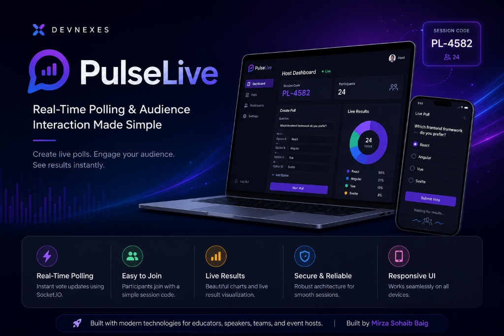
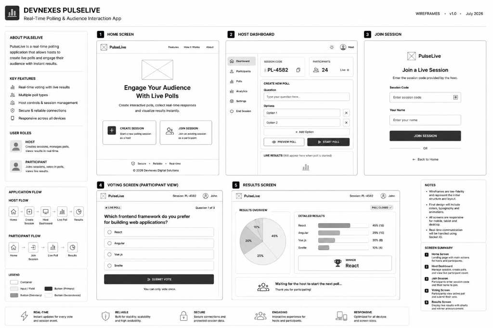

<p align="center">
  
</p>

# 🚀 Devnexes PulseLive

> A Real-Time Polling & Audience Interaction Web Application built as part of the **Devnexes Internship Program**.

PulseLive is a modern web application that enables hosts to create live polling sessions while allowing participants to join instantly using a unique session code. Votes are synchronized in real time, providing an interactive experience for classrooms, webinars, workshops, conferences, and live events.

---

## 📖 Project Overview

PulseLive is designed to simplify audience engagement by providing a fast and intuitive real-time polling system.

Participants can join a live session without creating an account, submit their votes instantly, and view results as they update in real time.

This repository currently contains the **Week 1 Planning & Documentation Phase**, which establishes the project's architecture, workflow, UI planning, and development roadmap before implementation begins.

---

## ✨ Planned Features

- 🎯 Real-Time Polling
- 🔐 Unique Session Code
- 👨‍🏫 Host Dashboard
- 👥 Participant Interface
- 📊 Live Poll Results
- ⚡ Socket.IO Real-Time Communication
- 📱 Responsive UI
- 📈 Poll Analytics
- 🔄 Multiple Polls per Session
- 🎨 Modern User Experience

---

## 🛠️ Technology Stack

### Frontend

- React.js (Vite)
- Tailwind CSS
- React Router
- Axios
- Socket.IO Client
- Framer Motion

### Backend

- Node.js
- Express.js
- Socket.IO
- Prisma ORM

### Database

- PostgreSQL

### Development Tools

- Git & GitHub
- VS Code
- Postman
- npm

---

# 📂 Project Structure

```text
Devnexes-PulseLive
│
├── docs
│   ├── Week-1-Project-Planning.md
│   ├── Session-State-Machine.md
│   ├── Socket-Events.md
│   ├── Wireframes.md
│   ├── Weekly-Progress-Report.md
│   ├── Testing-Evidence.md
│   └── wireframes.png
│
├── client            (Coming Soon)
├── server            (Coming Soon)
├── database          (Coming Soon)
│
└── README.md
```

---

# 📚 Documentation

| Document | Description |
|----------|-------------|
| Week-1-Project-Planning.md | Project planning and objectives |
| Session-State-Machine.md | Session lifecycle and workflow |
| Socket-Events.md | Socket.IO communication contract |
| Wireframes.md | UI wireframes and screen descriptions |
| Weekly-Progress-Report.md | Week 1 progress summary |
| Testing-Evidence.md | Documentation verification and testing |

---

# 🎨 Application Wireframes

The following wireframes were designed during Week 1 to define the application's user flow before development.



---

# 🗺️ Development Roadmap

## ✅ Week 1 — Planning & Documentation

- Repository Setup
- Project Planning
- Session State Machine
- Socket Event Contract
- Wireframes
- Weekly Progress Report
- Testing Evidence

**Status:** ✅ Completed

---

## 🚧 Week 2 — Core Development

- React.js Setup
- Node.js Setup
- Express Server
- PostgreSQL Configuration
- Prisma ORM
- Tailwind CSS
- Project Folder Structure

---

## 📅 Upcoming Development

- Host Dashboard
- Join Session
- Live Polling
- Real-Time Voting
- Poll Results
- Charts & Analytics
- Deployment

---

# 🚀 Getting Started

### Clone the Repository

```bash
git clone https://github.com/MirzaSohaibBaig-dev/Devnexes-PulseLive.git
```

### Navigate to Project

```bash
cd Devnexes-PulseLive
```

> Development setup will be available starting from Week 2.

---

# 👨‍💻 Author

**Mirza Sohaib Baig**

BS Computer Science Graduate

---

# 📌 Internship

This project is being developed as part of the **Devnexes Internship Program**, following a structured weekly development roadmap.

---

# ⭐ Current Status

🟢 **Week 1 Completed Successfully**

The project planning, documentation, system architecture, UI wireframes, and repository setup have been completed successfully.

The implementation phase will begin in **Week 2**.

---

## 📄 License

This project is created for educational and internship purposes.